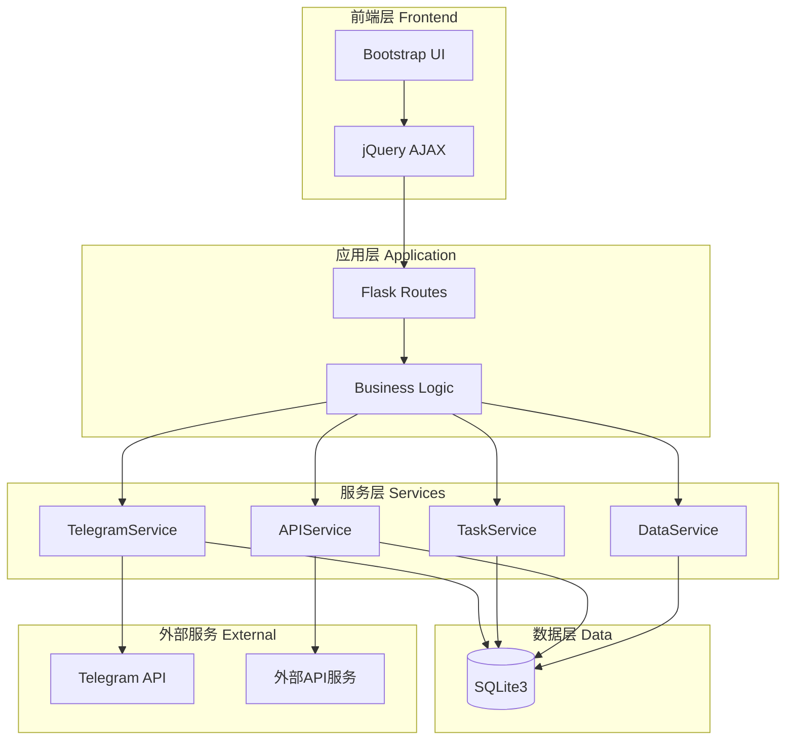
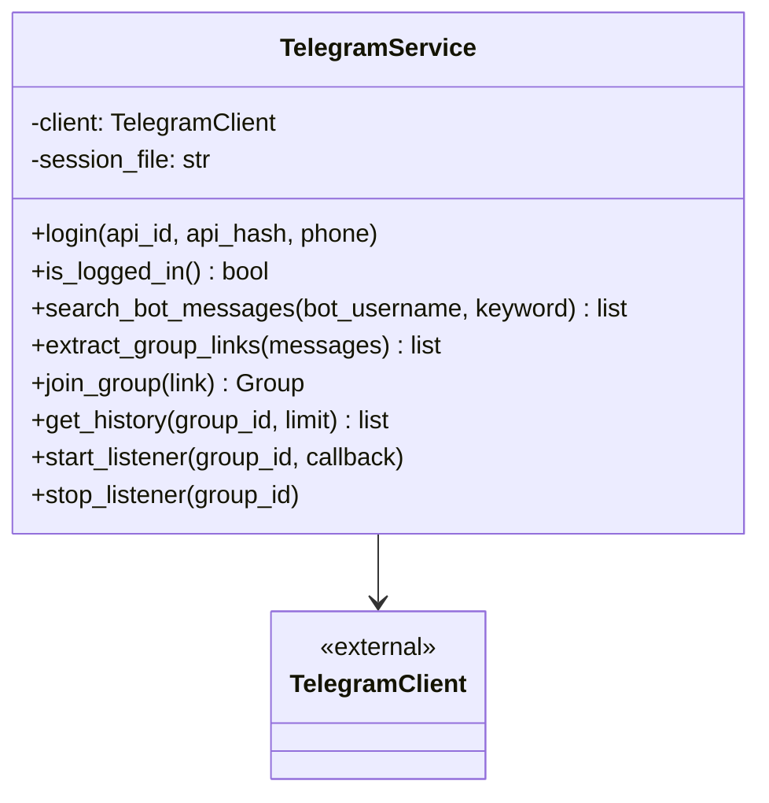
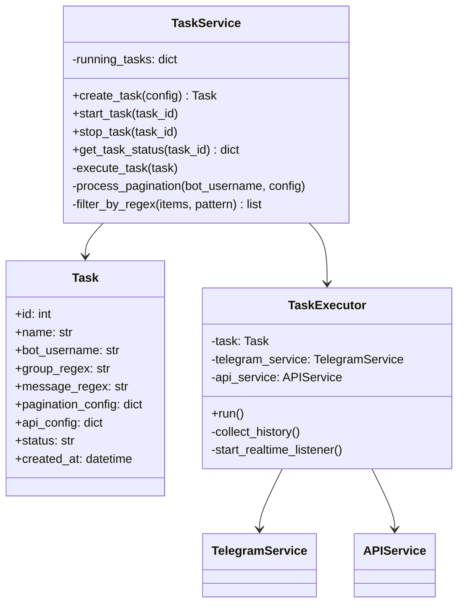
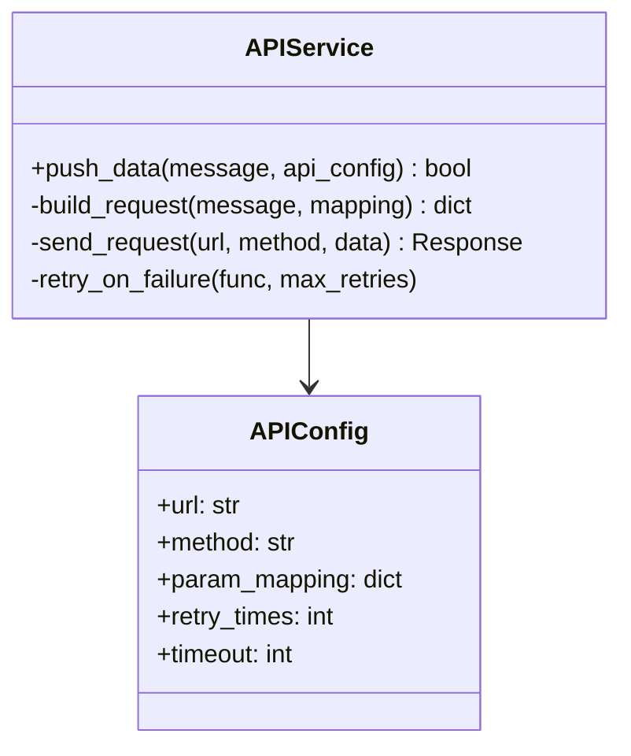
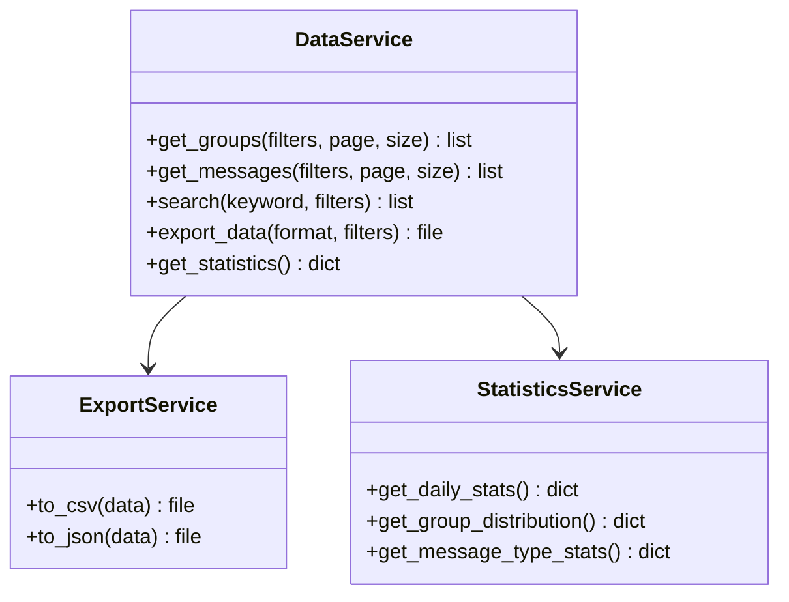
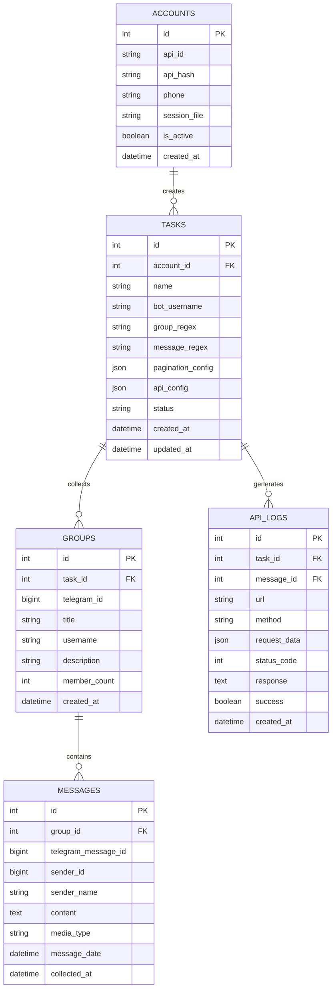
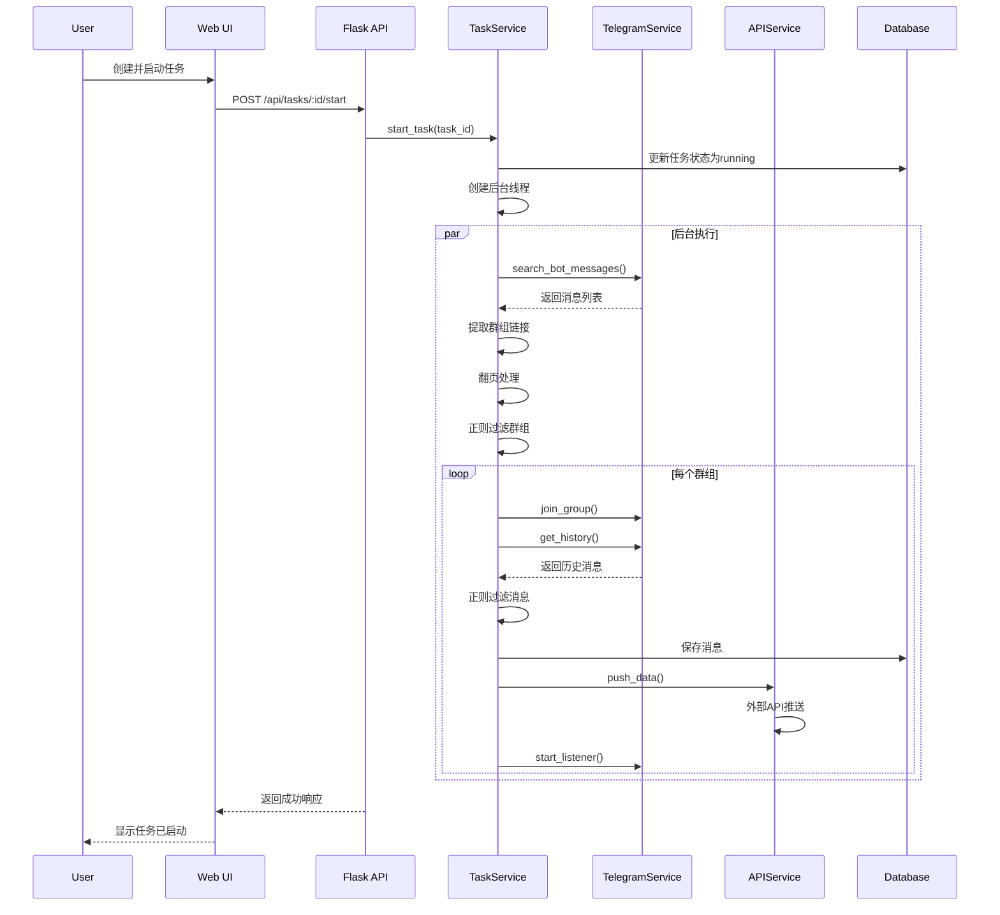
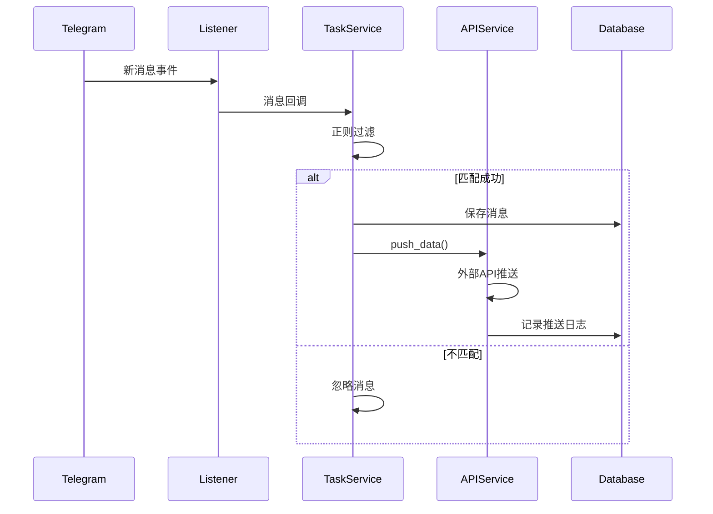

# Telegram群组/频道采集系统 - 架构设计文档

## 1. 系统架构概览

### 1.1 整体架构图



### 1.2 分层设计

#### 表现层 (Presentation Layer)
- **职责**: 用户界面展示和交互
- **技术**: Bootstrap 5 + jQuery
- **组件**:
  - 账号配置页面
  - 任务管理页面
  - 数据展示页面
  - 统计图表页面

#### 应用层 (Application Layer)
- **职责**: 路由处理和业务逻辑编排
- **技术**: Flask 3.x
- **组件**:
  - RESTful API路由
  - 请求验证
  - 响应格式化

#### 服务层 (Service Layer)
- **职责**: 核心业务逻辑实现
- **组件**:
  - TelegramService: Telegram客户端管理
  - TaskService: 任务调度和执行
  - APIService: 外部API推送
  - DataService: 数据查询和处理

#### 数据层 (Data Layer)
- **职责**: 数据持久化
- **技术**: SQLite3
- **组件**: ORM模型和数据库操作

---

## 2. 核心模块设计

### 2.1 Telegram服务模块



**核心功能**:
1. **账号管理**
   - 登录验证（手机号+验证码）
   - 会话持久化（.session文件）
   - 登录状态检查

2. **消息搜索**
   - 与机器人对话
   - 搜索关键词
   - 提取群组/频道链接

3. **群组操作**
   - 加入群组/频道
   - 获取群组信息
   - 采集历史消息

4. **实时监听**
   - 注册消息监听器
   - 新消息回调处理
   - 监听器生命周期管理

### 2.2 任务服务模块



**核心功能**:
1. **任务管理**
   - 创建/编辑/删除任务
   - 任务配置验证
   - 任务状态跟踪

2. **任务执行**
   - 后台线程执行
   - 搜索机器人对话
   - 翻页处理
   - 正则过滤
   - 历史消息采集
   - 实时监听启动

3. **翻页处理**
   - 识别下一页按钮
   - 自动翻页
   - 链接去重

### 2.3 API推送服务模块



**核心功能**:
1. **数据推送**
   - 参数映射
   - HTTP请求发送
   - 失败重试机制

2. **日志记录**
   - 推送成功/失败日志
   - 错误信息记录

### 2.4 数据服务模块



**核心功能**:
1. **数据查询**
   - 分页查询
   - 条件过滤
   - 关键词搜索

2. **数据导出**
   - CSV格式
   - JSON格式

3. **统计分析**
   - 采集趋势
   - 群组分布
   - 消息类型统计

---

## 3. 数据库设计

### 3.1 ER图



### 3.2 表结构详细设计

#### accounts (账号表)
```sql
CREATE TABLE accounts (
    id INTEGER PRIMARY KEY AUTOINCREMENT,
    api_id VARCHAR(50) NOT NULL,
    api_hash VARCHAR(100) NOT NULL,
    phone VARCHAR(20) NOT NULL,
    session_file VARCHAR(255),
    is_active BOOLEAN DEFAULT 1,
    created_at DATETIME DEFAULT CURRENT_TIMESTAMP
);
```

#### tasks (任务表)
```sql
CREATE TABLE tasks (
    id INTEGER PRIMARY KEY AUTOINCREMENT,
    account_id INTEGER NOT NULL,
    name VARCHAR(100) NOT NULL,
    bot_username VARCHAR(100) NOT NULL,
    group_regex TEXT,
    message_regex TEXT,
    pagination_config TEXT, -- JSON格式
    api_config TEXT, -- JSON格式
    status VARCHAR(20) DEFAULT 'pending', -- pending/running/stopped/completed/failed
    created_at DATETIME DEFAULT CURRENT_TIMESTAMP,
    updated_at DATETIME DEFAULT CURRENT_TIMESTAMP,
    FOREIGN KEY (account_id) REFERENCES accounts(id)
);
```

#### groups (群组表)
```sql
CREATE TABLE groups (
    id INTEGER PRIMARY KEY AUTOINCREMENT,
    task_id INTEGER NOT NULL,
    telegram_id BIGINT UNIQUE NOT NULL,
    title VARCHAR(255),
    username VARCHAR(100),
    description TEXT,
    member_count INTEGER,
    created_at DATETIME DEFAULT CURRENT_TIMESTAMP,
    FOREIGN KEY (task_id) REFERENCES tasks(id)
);
```

#### messages (消息表)
```sql
CREATE TABLE messages (
    id INTEGER PRIMARY KEY AUTOINCREMENT,
    group_id INTEGER NOT NULL,
    telegram_message_id BIGINT NOT NULL,
    sender_id BIGINT,
    sender_name VARCHAR(255),
    content TEXT,
    media_type VARCHAR(50), -- text/photo/video/document/etc
    message_date DATETIME,
    collected_at DATETIME DEFAULT CURRENT_TIMESTAMP,
    FOREIGN KEY (group_id) REFERENCES groups(id),
    UNIQUE(group_id, telegram_message_id)
);
```

#### api_logs (API日志表)
```sql
CREATE TABLE api_logs (
    id INTEGER PRIMARY KEY AUTOINCREMENT,
    task_id INTEGER NOT NULL,
    message_id INTEGER,
    url VARCHAR(500),
    method VARCHAR(10),
    request_data TEXT, -- JSON格式
    status_code INTEGER,
    response TEXT,
    success BOOLEAN,
    created_at DATETIME DEFAULT CURRENT_TIMESTAMP,
    FOREIGN KEY (task_id) REFERENCES tasks(id),
    FOREIGN KEY (message_id) REFERENCES messages(id)
);
```

---

## 4. 接口设计

### 4.1 RESTful API规范

#### 基础响应格式
```json
{
    "code": 200,
    "message": "success",
    "data": {}
}
```

### 4.2 API端点列表

#### 账号管理
```
POST   /api/auth/login          # 登录
GET    /api/auth/status         # 获取登录状态
POST   /api/auth/verify         # 验证码验证
POST   /api/auth/logout         # 登出
```

#### 任务管理
```
GET    /api/tasks               # 获取任务列表
POST   /api/tasks               # 创建任务
GET    /api/tasks/:id           # 获取任务详情
PUT    /api/tasks/:id           # 更新任务
DELETE /api/tasks/:id           # 删除任务
POST   /api/tasks/:id/start     # 启动任务
POST   /api/tasks/:id/stop      # 停止任务
```

#### 数据管理
```
GET    /api/groups              # 获取群组列表
GET    /api/messages            # 获取消息列表
GET    /api/search              # 搜索数据
GET    /api/export              # 导出数据
GET    /api/statistics          # 获取统计数据
```

### 4.3 关键接口详细设计

#### 创建任务
```
POST /api/tasks
Content-Type: application/json

Request:
{
    "name": "采集任务1",
    "bot_username": "search_bot",
    "group_regex": ".*crypto.*",
    "message_regex": ".*bitcoin.*",
    "pagination_config": {
        "next_button_text": "下一页",
        "max_pages": 10
    },
    "api_config": {
        "url": "https://api.example.com/webhook",
        "method": "POST",
        "param_mapping": {
            "content": "message",
            "sender": "user",
            "timestamp": "time"
        }
    }
}

Response:
{
    "code": 200,
    "message": "任务创建成功",
    "data": {
        "task_id": 1
    }
}
```

---

## 5. 数据流设计

### 5.1 任务执行流程



### 5.2 实时监听流程



---

## 6. 异常处理策略

### 6.1 异常分类

#### 系统异常
- 数据库连接失败
- 文件读写错误
- 内存溢出

**处理策略**: 记录日志、返回500错误、尝试恢复

#### 业务异常
- Telegram登录失败
- 任务配置错误
- 正则表达式错误

**处理策略**: 返回友好错误信息、更新任务状态

#### 外部异常
- Telegram API限流
- 外部API推送失败
- 网络超时

**处理策略**: 重试机制、降级处理、记录日志

### 6.2 重试机制

```python
# API推送重试
max_retries = 3
retry_delay = [1, 3, 5]  # 秒

# Telegram API重试
max_retries = 5
exponential_backoff = True
```

---

## 7. 安全设计

### 7.1 敏感信息保护
- API密钥存储在 `.env` 文件
- Session文件加密存储
- 数据库密码字段加密

### 7.2 输入验证
- 正则表达式语法验证
- URL格式验证
- 参数类型检查

### 7.3 错误信息脱敏
- 不暴露内部路径
- 不暴露数据库结构
- 不暴露API密钥

---

## 8. 性能优化

### 8.1 数据库优化
- 为常用查询字段添加索引
- 使用分页查询避免大量数据加载
- 定期清理过期日志

### 8.2 并发控制
- 单任务单线程执行
- 使用线程锁保护共享资源
- 限制最大并发任务数

### 8.3 缓存策略
- 任务状态缓存（内存）
- 统计数据缓存（5分钟）

---

## 9. 部署架构

### 9.1 单机部署

```
┌─────────────────────────────────┐
│      服务器 (Windows/Linux)      │
│                                 │
│  ┌──────────────────────────┐  │
│  │   Flask Application      │  │
│  │   (Gunicorn/Waitress)    │  │
│  └──────────────────────────┘  │
│                                 │
│  ┌──────────────────────────┐  │
│  │   SQLite3 Database       │  │
│  └──────────────────────────┘  │
│                                 │
│  ┌──────────────────────────┐  │
│  │   Telegram Sessions      │  │
│  └──────────────────────────┘  │
└─────────────────────────────────┘
```

### 9.2 目录结构
```
/opt/telegram-collector/
├── app.py
├── config.py
├── requirements.txt
├── .env
├── data/
│   ├── telegram_collector.db
│   └── sessions/
│       └── *.session
├── logs/
│   └── app.log
└── ...
```

---

## 10. 技术选型说明

### 10.1 核心依赖
```
Flask==3.0.0
Telethon==1.34.0
requests==2.31.0
python-dotenv==1.0.0
```

### 10.2 前端依赖 (CDN)
```
Bootstrap 5.3.0
jQuery 3.7.0
Chart.js 4.4.0
```

---

**文档版本**: v1.0  
**创建时间**: 2025-12-03  
**状态**: ✅ 设计完成
