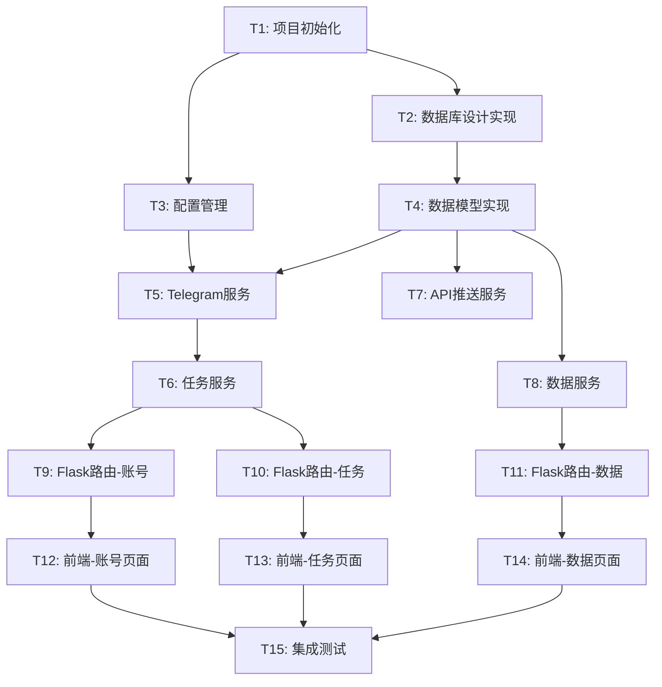

# Telegram群组/频道采集系统 - 任务拆分文档

## 任务依赖关系图

---

## T1: 项目初始化

### 输入契约
- **前置依赖**: 无
- **输入数据**: Python 3.12环境
- **环境依赖**: pip包管理器

### 任务描述
创建项目基础结构、配置文件和依赖管理。

### 实现步骤
1. 创建项目目录结构
2. 创建 `requirements.txt`
3. 创建 `.env.example`
4. 创建 `.gitignore`
5. 创建 `README.md`

### 输出契约
- **交付物**:
  - 完整的项目目录结构
  - `requirements.txt` (包含所有依赖)
  - `.env.example` (环境变量模板)
  - `.gitignore` (Git忽略配置)
  - `README.md` (项目说明)

- **验收标准**:
  - [ ] 目录结构符合设计文档
  - [ ] 可以成功执行 `pip install -r requirements.txt`
  - [ ] `.gitignore` 包含敏感文件

### 实现约束
- Python 3.12兼容
- 使用标准项目结构

---

## T2: 数据库设计实现

### 输入契约
- **前置依赖**: T1
- **输入数据**: 数据库设计文档
- **环境依赖**: SQLite3

### 任务描述
实现数据库初始化脚本和表结构创建。

### 实现步骤
1. 创建 `database/db.py` (数据库连接管理)
2. 创建数据库初始化脚本
3. 创建所有表结构 (accounts, tasks, groups, messages, api_logs)
4. 添加索引优化

### 输出契约
- **交付物**:
  - `database/db.py`
  - `database/init_db.py`
  - 数据库初始化函数

- **验收标准**:
  - [ ] 数据库文件自动创建
  - [ ] 所有表结构正确
  - [ ] 索引创建成功
  - [ ] 可以执行基本CRUD操作

### 实现约束
- 使用SQLite3标准库
- 支持自动创建数据库

---

## T3: 配置管理

### 输入契约
- **前置依赖**: T1
- **输入数据**: 配置需求
- **环境依赖**: python-dotenv

### 任务描述
实现配置文件管理和环境变量加载。

### 实现步骤
1. 创建 `config.py`
2. 实现环境变量加载
3. 定义配置类
4. 添加配置验证

### 输出契约
- **交付物**:
  - `config.py`
  - 配置类定义

- **验收标准**:
  - [ ] 可以从 `.env` 加载配置
  - [ ] 提供默认配置值
  - [ ] 配置验证正常工作

### 实现约束
- 使用 python-dotenv
- 支持开发/生产环境切换

---

## T4: 数据模型实现

### 输入契约
- **前置依赖**: T2
- **输入数据**: 数据库表结构
- **环境依赖**: SQLite3

### 任务描述
实现ORM模型和数据库操作封装。

### 实现步骤
1. 创建 `database/models.py`
2. 定义所有模型类 (Account, Task, Group, Message, APILog)
3. 实现CRUD方法
4. 添加查询辅助方法

### 输出契约
- **交付物**:
  - `database/models.py`
  - 所有模型类
  - CRUD操作方法

- **验收标准**:
  - [ ] 所有模型类定义完整
  - [ ] CRUD操作正常
  - [ ] 支持分页查询
  - [ ] 支持条件过滤

### 实现约束
- 使用原生SQL或轻量级ORM
- 保持代码简洁

---

## T5: Telegram服务实现

### 输入契约
- **前置依赖**: T3, T4
- **输入数据**: Telegram API配置
- **环境依赖**: Telethon

### 任务描述
实现Telegram客户端封装和核心功能。

### 实现步骤
1. 创建 `services/telegram_service.py`
2. 实现登录功能
3. 实现会话管理
4. 实现消息搜索
5. 实现群组操作
6. 实现实时监听

### 输出契约
- **交付物**:
  - `services/telegram_service.py`
  - TelegramService类

- **验收标准**:
  - [ ] 登录流程完整（手机号+验证码）
  - [ ] 会话持久化正常
  - [ ] 可以搜索机器人消息
  - [ ] 可以提取群组链接
  - [ ] 可以加入群组
  - [ ] 可以获取历史消息
  - [ ] 实时监听正常工作

### 实现约束
- 使用Telethon 1.34.0
- 异步操作使用asyncio
- 错误处理完善

---

## T6: 任务服务实现

### 输入契约
- **前置依赖**: T5
- **输入数据**: 任务配置
- **环境依赖**: threading, asyncio

### 任务描述
实现任务管理和执行逻辑。

### 实现步骤
1. 创建 `services/task_service.py`
2. 实现任务CRUD
3. 实现任务执行器
4. 实现翻页逻辑
5. 实现正则过滤
6. 实现后台线程管理

### 输出契约
- **交付物**:
  - `services/task_service.py`
  - TaskService类
  - TaskExecutor类

- **验收标准**:
  - [ ] 任务创建/编辑/删除正常
  - [ ] 任务可以后台执行
  - [ ] 翻页功能正常
  - [ ] 正则过滤正确
  - [ ] 任务状态管理正确
  - [ ] 可以停止运行中的任务

### 实现约束
- 使用threading实现后台任务
- 任务状态通过数据库同步
- 异常不影响主程序

---

## T7: API推送服务实现

### 输入契约
- **前置依赖**: T4
- **输入数据**: API配置
- **环境依赖**: requests

### 任务描述
实现外部API数据推送功能。

### 实现步骤
1. 创建 `services/api_service.py`
2. 实现参数映射
3. 实现HTTP请求发送
4. 实现重试机制
5. 实现日志记录

### 输出契约
- **交付物**:
  - `services/api_service.py`
  - APIService类

- **验收标准**:
  - [ ] 支持GET/POST请求
  - [ ] 参数映射正确
  - [ ] 失败重试正常
  - [ ] 推送日志完整

### 实现约束
- 使用requests库
- 超时时间30秒
- 最多重试3次

---

## T8: 数据服务实现

### 输入契约
- **前置依赖**: T4
- **输入数据**: 数据查询需求
- **环境依赖**: SQLite3

### 任务描述
实现数据查询、导出和统计功能。

### 实现步骤
1. 创建 `services/data_service.py`
2. 实现分页查询
3. 实现搜索过滤
4. 实现数据导出 (CSV/JSON)
5. 实现统计分析

### 输出契约
- **交付物**:
  - `services/data_service.py`
  - DataService类
  - ExportService类
  - StatisticsService类

- **验收标准**:
  - [ ] 分页查询正常
  - [ ] 搜索过滤准确
  - [ ] CSV导出格式正确
  - [ ] JSON导出格式正确
  - [ ] 统计数据准确

### 实现约束
- 每页50条数据
- 导出文件保存到临时目录
- 统计数据缓存5分钟

---

## T9: Flask路由-账号管理

### 输入契约
- **前置依赖**: T5
- **输入数据**: API设计文档
- **环境依赖**: Flask 3.x

### 任务描述
实现账号管理相关的API路由。

### 实现步骤
1. 创建 `routes/auth.py`
2. 实现登录接口
3. 实现状态查询接口
4. 实现验证码验证接口
5. 实现登出接口

### 输出契约
- **交付物**:
  - `routes/auth.py`
  - 账号管理API端点

- **验收标准**:
  - [ ] POST /api/auth/login 正常
  - [ ] GET /api/auth/status 正常
  - [ ] POST /api/auth/verify 正常
  - [ ] POST /api/auth/logout 正常
  - [ ] 错误处理完善

### 实现约束
- 遵循RESTful规范
- 统一响应格式
- 参数验证完整

---

## T10: Flask路由-任务管理

### 输入契约
- **前置依赖**: T6
- **输入数据**: API设计文档
- **环境依赖**: Flask 3.x

### 任务描述
实现任务管理相关的API路由。

### 实现步骤
1. 创建 `routes/tasks.py`
2. 实现任务CRUD接口
3. 实现任务启动/停止接口
4. 添加参数验证

### 输出契约
- **交付物**:
  - `routes/tasks.py`
  - 任务管理API端点

- **验收标准**:
  - [ ] GET /api/tasks 正常
  - [ ] POST /api/tasks 正常
  - [ ] GET /api/tasks/:id 正常
  - [ ] PUT /api/tasks/:id 正常
  - [ ] DELETE /api/tasks/:id 正常
  - [ ] POST /api/tasks/:id/start 正常
  - [ ] POST /api/tasks/:id/stop 正常

### 实现约束
- 遵循RESTful规范
- 正则表达式验证
- 配置格式验证

---

## T11: Flask路由-数据管理

### 输入契约
- **前置依赖**: T8
- **输入数据**: API设计文档
- **环境依赖**: Flask 3.x

### 任务描述
实现数据管理相关的API路由。

### 实现步骤
1. 创建 `routes/data.py`
2. 实现数据查询接口
3. 实现搜索接口
4. 实现导出接口
5. 实现统计接口

### 输出契约
- **交付物**:
  - `routes/data.py`
  - 数据管理API端点

- **验收标准**:
  - [ ] GET /api/groups 正常
  - [ ] GET /api/messages 正常
  - [ ] GET /api/search 正常
  - [ ] GET /api/export 正常
  - [ ] GET /api/statistics 正常

### 实现约束
- 支持分页参数
- 支持过滤参数
- 导出文件流式传输

---

## T12: 前端-账号配置页面

### 输入契约
- **前置依赖**: T9
- **输入数据**: UI设计需求
- **环境依赖**: Bootstrap 5, jQuery

### 任务描述
实现账号配置和登录界面。

### 实现步骤
1. 创建 `templates/base.html` (基础模板)
2. 创建 `templates/auth.html`
3. 创建 `static/css/custom.css`
4. 创建 `static/js/auth.js`
5. 实现登录表单
6. 实现验证码输入
7. 实现状态显示

### 输出契约
- **交付物**:
  - `templates/base.html`
  - `templates/auth.html`
  - `static/css/custom.css`
  - `static/js/auth.js`

- **验收标准**:
  - [ ] 界面美观现代
  - [ ] 响应式设计
  - [ ] 登录流程顺畅
  - [ ] 错误提示友好
  - [ ] 状态显示清晰

### 实现约束
- 使用Bootstrap 5
- 使用jQuery AJAX
- 支持移动端

---

## T13: 前端-任务管理页面

### 输入契约
- **前置依赖**: T10
- **输入数据**: UI设计需求
- **环境依赖**: Bootstrap 5, jQuery

### 任务描述
实现任务管理界面。

### 实现步骤
1. 创建 `templates/tasks.html`
2. 创建 `static/js/tasks.js`
3. 实现任务列表
4. 实现任务创建表单
5. 实现任务编辑表单
6. 实现任务操作按钮
7. 实现状态实时更新

### 输出契约
- **交付物**:
  - `templates/tasks.html`
  - `static/js/tasks.js`

- **验收标准**:
  - [ ] 任务列表显示正常
  - [ ] 创建任务表单完整
  - [ ] 编辑功能正常
  - [ ] 启动/停止按钮正常
  - [ ] 状态实时更新
  - [ ] 配置项清晰易懂

### 实现约束
- 表单验证完整
- 正则表达式输入提示
- 配置项使用JSON编辑器

---

## T14: 前端-数据展示页面

### 输入契约
- **前置依赖**: T11
- **输入数据**: UI设计需求
- **环境依赖**: Bootstrap 5, jQuery, Chart.js

### 任务描述
实现数据展示、搜索和统计界面。

### 实现步骤
1. 创建 `templates/data.html`
2. 创建 `static/js/data.js`
3. 实现群组列表
4. 实现消息列表
5. 实现搜索过滤
6. 实现数据导出
7. 实现统计图表

### 输出契约
- **交付物**:
  - `templates/data.html`
  - `static/js/data.js`

- **验收标准**:
  - [ ] 数据列表分页正常
  - [ ] 搜索功能准确
  - [ ] 过滤功能正常
  - [ ] 导出功能正常
  - [ ] 图表显示美观
  - [ ] 统计数据准确

### 实现约束
- 使用Chart.js绘制图表
- 分页每页50条
- 导出支持CSV和JSON

---

## T15: 集成测试与优化

### 输入契约
- **前置依赖**: T12, T13, T14
- **输入数据**: 完整系统
- **环境依赖**: 测试环境

### 任务描述
进行端到端测试和性能优化。

### 实现步骤
1. 创建 `app.py` (Flask应用入口)
2. 集成所有模块
3. 端到端功能测试
4. 性能测试和优化
5. 错误处理完善
6. 文档更新

### 输出契约
- **交付物**:
  - `app.py`
  - 完整可运行的系统
  - 测试报告

- **验收标准**:
  - [ ] 所有功能正常工作
  - [ ] 登录流程完整
  - [ ] 任务执行正常
  - [ ] 数据采集准确
  - [ ] API推送成功
  - [ ] 界面美观流畅
  - [ ] 错误处理完善
  - [ ] 性能满足要求

### 实现约束
- 完整的错误处理
- 日志记录完善
- 性能优化到位

---

## 任务执行顺序

### 第一批（并行）
- T1: 项目初始化

### 第二批（并行）
- T2: 数据库设计实现
- T3: 配置管理

### 第三批（并行）
- T4: 数据模型实现

### 第四批（并行）
- T5: Telegram服务实现

### 第五批（并行）
- T6: 任务服务实现
- T7: API推送服务实现
- T8: 数据服务实现

### 第六批（并行）
- T9: Flask路由-账号管理
- T10: Flask路由-任务管理
- T11: Flask路由-数据管理

### 第七批（并行）
- T12: 前端-账号配置页面
- T13: 前端-任务管理页面
- T14: 前端-数据展示页面

### 第八批（串行）
- T15: 集成测试与优化

---

## 总体时间估算

- T1: 0.5小时
- T2: 1小时
- T3: 0.5小时
- T4: 1.5小时
- T5: 3小时
- T6: 3小时
- T7: 1小时
- T8: 2小时
- T9: 1小时
- T10: 1.5小时
- T11: 1.5小时
- T12: 2小时
- T13: 2.5小时
- T14: 2.5小时
- T15: 2小时

**总计**: 约25小时

---

**文档版本**: v1.0  
**创建时间**: 2025-12-03  
**状态**: ✅ 任务拆分完成
